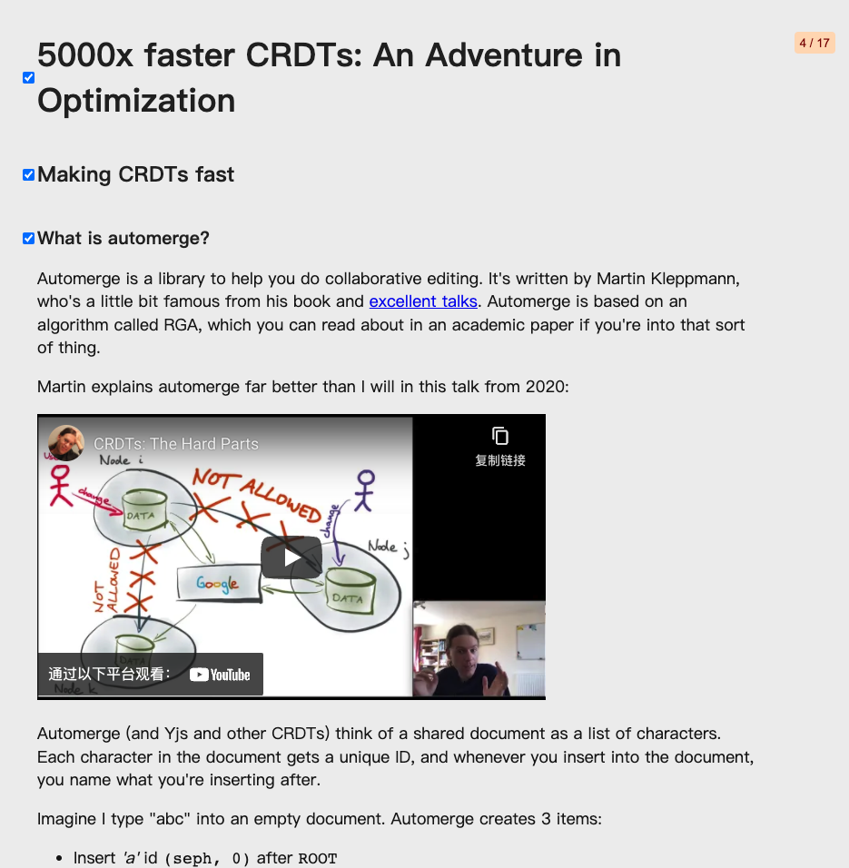
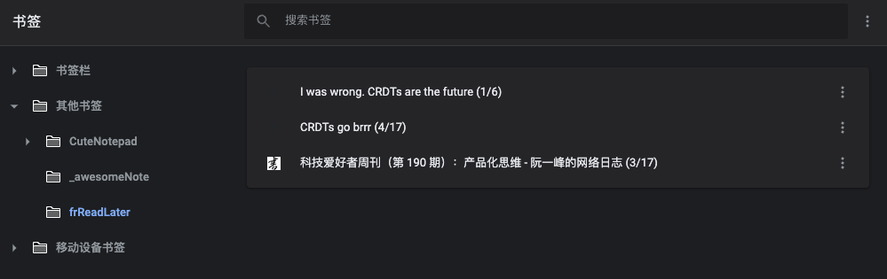

# 怎么开始
- Step 1: [点击这里](https://chrome.google.com/webstore/detail/toggle-heading/ikcdglpmgffjnelbcaceahjpkocjfedm/related?hl=zh-CN) 从google store 下载

- Step 2: 打开你要浏览的页面（文章/论文/新闻/文档之类的），点击安装好的插件

- Step 2: 这时你就能看到页面已经按照标题折叠起来

# 更多功能

## 已读/所有
- 点击插件后，每个段落标题左边会有一个checkbox，你可以使用它，标记这个段落你是否已读
- 右上角有一个按钮显示文章，已读和总段落的比例 done/all

## 稍后阅读
- 鼠标悬浮在 右上角的按钮上，显示 read later
- 点击read later, 把文章添加到书签中，目录为： 其他/frReadLater/{当前文章标题 done/all}

## 标记为完成
- 当网页已经被添加到read later中，鼠标再次悬浮在右上角的按钮，显示mark as finished
- 点击 mark as finished, 把所有段落checkbox标记为已读，把当前文章从 read later书签目录中移除

# 效果展示
## 有些网站并非使用语意化标签，以下是一些运行良好的例子：
- [阮一峰博客](https://www.ruanyifeng.com/blog/2022/01/weekly-issue-191.html)
- [Seph Gentle](https://josephg.com/blog/crdts-go-brrr/)

# Q&A
## 适用人群？
：适用于每天阅读大量资料（新闻/文档/博客/论文等）的研究员、工程师、分析师或文案工作者，帮助大家更有效的阅读。
## 如果页面表现不是你期望结果？ 
：刷新即可恢复到原来的状态
## 如果遇到bug，或有比较好的想法？
：请通过github上提 [issue](https://github.com/FrankZhai367/toggle-heading/issues)